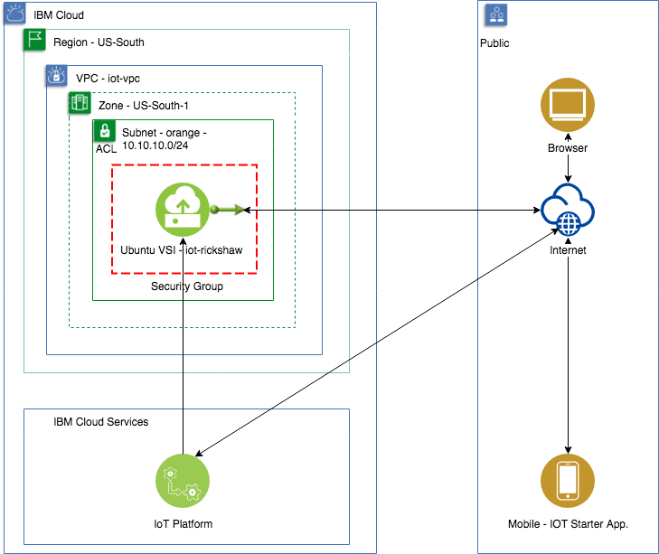

# IoT Application

## Purpose

There are two goals for this scenario
1. To prove that an IoT application can be run within a VPC.
2. To build the enablement material to show how an IoT application can be deployed and managed within a VPC.

## Architecture

## VPC Functional Coverage
| Function | Result | Notes |
| -------- | ------ | ----- |
| VPC | :white_check_mark: | |
| Floating IPv4 | :white_check_mark: | |
| Subnet & BYO Private IP | :white_check_mark: | |
| Instance| :white_check_mark: | | |

## Prerequisites
The common prerequisite to starting the VPC specific steps is to setup the IoT Platform by creating the service, registering the device and application, and capturing the Application API key and token. Additionally the IOT starter application has to be installed on the mobile device. The steps to setting up the IoT platform and the mobile device can be found in the [IoT guide](IoT.md).

## Deploying the Scenario
* [Deploy using the CLI](CLI.md)
* [Deploy using the UI](UI.md)
* [Deploy using the API](API.md)
